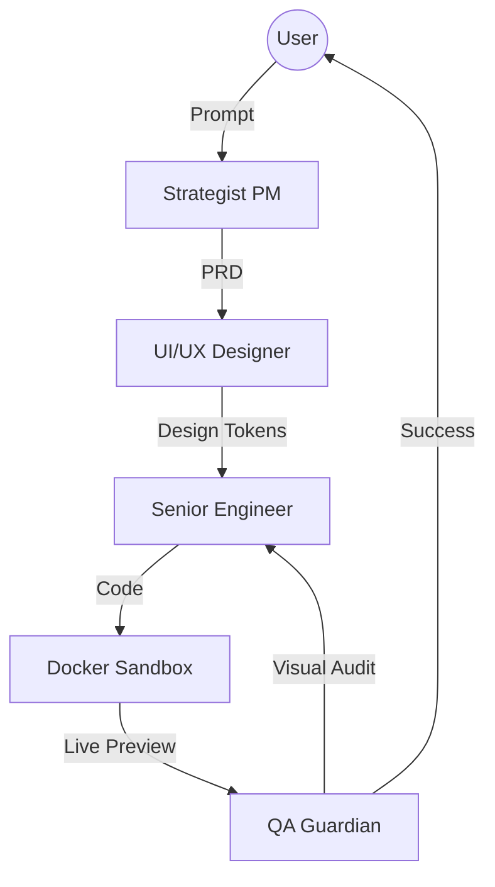

# 🌐 NexusSite-AI

> **面向现代网站的自治 AI 工作室。**  
> 在具备自愈能力的 Docker 沙盒中完成网站的构建、设计与测试，产出可用于生产环境的交付物。

[](https://opensource.org/licenses/MIT)
[](https://www.python.org/)
[](https://www.docker.com/)
[](https://github.com/langchain-ai/langgraph)

---

## 🚀 概览

**NexusSite-AI** 不只是一个代码生成器，而是一支全栈、多智能体（MAS）的 AI 团队，覆盖 Web 开发的完整生命周期——从需求分析到可部署的交付质量。

不同于传统 AI 工具只输出零散的代码片段，NexusSite-AI 在 **双容器沙盒（Dual-Container Sandbox）** 内运行，确保每一行代码在交付之前都完成构建、渲染，并通过视觉验收。

### 为什么选择 NexusSite-AI？

- **自治工作流**：基于 LangGraph 的多智能体系统（MAS），模拟真实研发团队的协作方式。
- **自愈闭环**：若构建失败或 UI 破坏，QA Guardian 会触发自动修复回路。
- **视觉一致性**：集成多模态视觉能力，保证最终 UI 与设计意图一致。
- **Docker 优先**：零配置运行环境，减少"在我电脑上能跑"的环境差异问题。

---

## 🏗️ 架构

NexusSite-AI 采用 **控制与执行分离（Control-Execution Separation）** 的架构模型：

1. **Orchestrator（大脑）**：FastAPI + LangGraph，负责管理 4 个智能体的状态机。
2. **Sandbox（工厂）**：独立的 Node.js/Next.js 环境，用于实时渲染与预览。



---

## 👥 智能体团队

| Agent | Expertise | Deliverables |
| :--- | :--- | :--- |
| **🕵️ Strategist PM** | Market Research & SEO | Structured PRD & Sitemap |
| **🎨 UI/UX Designer** | Modern Aesthetics & Tailwind | Design Tokens & Layout Specs |
| **💻 Senior Engineer** | Next.js & Atomic Design | Production-grade React Code |
| **🔍 QA Guardian** | Build Integrity & VQA | Bug Reports & Visual Validation |

---

## 📁 项目结构

```
NexusSite-AI/
├── orchestrator/           # Python 后端 (FastAPI + LangGraph)
│   ├── agents/             # 多智能体实现
│   │   ├── pm_agent.py     # 策略产品经理
│   │   ├── designer_agent.py # UI/UX 设计师
│   │   ├── coder_agent.py  # 高级工程师
│   │   ├── qa_agent.py     # 质量守护
│   │   ├── reflector_agent.py # 反思智能体
│   │   └── llm_client.py   # LLM 客户端
│   ├── tools/              # 工具集
│   │   ├── docker_tool.py  # Docker 沙盒管理
│   │   └── log_bus.py      # 日志总线
│   ├── workflow/           # LangGraph 状态机
│   │   └── state_machine.py
│   ├── requirements.txt    # Python 依赖清单
│   ├── .env.example        # 环境变量示例
│   └── main.py             # FastAPI 入口
├── workspace/              # Next.js 沙盒 (AI 生成目标)
│   ├── app/                # Next.js App Router 页面
│   ├── components/         # UI 组件
│   └── package.json        # Node.js 依赖
├── web_ui/                 # 控制台 UI (Next.js)
│   ├── app/                # 控制台页面
│   ├── components/         # 控制台组件
│   └── package.json        # Node.js 依赖
├── docker-compose.yml      # 容器编排配置
├── Dockerfile.orchestrator # Orchestrator 镜像定义
└── README.md               # 本文档
```

---

## ⚡ 快速开始

### 前置条件
- **Docker Desktop**（含 Docker Compose）
- **OpenRouter API Key**（必需，用于 4 专家调用）
- （可选）**OpenCode Zen API Key**（如果你想用 `opencode/...` 模型）

### 网络问题处理（可选）

如果在拉取 Docker 镜像时遇到超时或网络错误（如 `dial tcp: connectex: A connection attempt failed`），可尝试以下方案：

**方案 1：配置镜像加速器（推荐）**

1. 打开 Docker Desktop → Settings → Docker Engine
2. 在 `registry-mirrors` 中添加国内镜像源：

```json
"registry-mirrors": ["https://registry.docker-cn.com", "https://mirror.ccs.tencentyun.com"]
```

3. 重启 Docker Desktop 后重新运行 `docker compose up -d --build`

**方案 2：手动提前拉取镜像**

```bash
docker pull python:3.10-slim
docker pull node:20-slim
```

**方案 3：使用国内镜像源**

修改 `Dockerfile.orchestrator` 和 `docker-compose.yml` 中的镜像地址为国内源：

```dockerfile
# Dockerfile.orchestrator
FROM registry.cn-hangzhou.aliyuncs.com/library/python:3.10-slim
```

```yaml
# docker-compose.yml
workspace:
  image: registry.cn-hangzhou.aliyuncs.com/library/node:20-slim
```

---

### 本项目启动后有哪些服务？

| 服务 | 端口 | 说明 |
|------|------|------|
| **Orchestrator API** | `http://localhost:8000` | 后端服务（FastAPI + LangGraph） |
| **Web 控制台** | `http://localhost:3002` | 工作台/对话框（交互控制中心） |
| **Workspace 预览** | `http://localhost:3003` | AI 生成过程的实时预览 |
| **项目官网** | `http://localhost:3003` | 营销网站/落地页（最终产出） |

### 安装与启动（推荐流程）
1. **进入项目根目录**（本仓库目录）。

2. **配置后端密钥**（必做）

   复制 `.env.example` 为 `.env`：

   ```bash
   cp orchestrator/.env.example orchestrator/.env
   ```

   打开 `orchestrator/.env`，至少填写：

   - `OPENROUTER_API_KEY=sk-or-v1-...`
   - `OPENROUTER_MODEL=qwen/qwen3.6-plus-preview:free`（默认已设置）

   可选（启用 Zen）：

   - `OPENCODE_ZEN_API_KEY=sk-...`

   > 完整的环境变量说明请参考 `.env.example` 文件。

3. **启动全部服务**

   ```bash
   docker compose up -d --build
   ```

4. **打开控制台并开始一次生成**

   - 打开 **Web 控制台**：`http://localhost:3002`
   - 在输入框描述你要的网站/页面，然后发送
   - 你可以点击输入框左侧 **⚙️** 打开"专家模型配置"

### 如何选择模型（OpenRouter / OpenCode Zen）
本项目使用 **角色级别的 `model_map`**（PM/Designer/Coder/QA 各自独立）。

- **OpenRouter**：在"专家模型配置"里先选 *OpenRouter / 提供商*，再选该提供商下的模型（例如 `qwen/...`、`openai/...`、`anthropic/...`）。
- **OpenCode Zen**：选择 *OpenCode Zen / opencode-zen*，再选 `opencode/...` 模型。
  - Zen 模型调用参考官方文档：[OpenCode Zen](https://opencode.ai/docs/zen/)
  - 若未配置 `OPENCODE_ZEN_API_KEY`，选择 `opencode/...` 会报缺少 key（属预期行为）。

### 预览与导出
- **预览 AI 生成过程**：打开 `http://localhost:3003`（或在 Web 控制台右上角点"预览"按钮）
- **查看项目官网**：同上，`http://localhost:3003` 即为最终营销网站
- **导出源码**：在 Web 控制台点"导出"，会下载后端打包的 `workspace/` 源码（不包含 `node_modules` / `.next` 等构建产物）

---

## 🔧 服务管理

### 启动服务

```bash
# 启动全部服务（推荐）
docker compose up -d

# 首次启动或需要重新构建
docker compose up -d --build
```

### 查看服务状态

```bash
docker compose ps
```

输出示例：
```
NAME                          IMAGE                       SERVICE        STATUS         PORTS
nexussite-ai-orchestrator-1   nexussite-ai-orchestrator   orchestrator   Up 2 minutes   0.0.0.0:8000->8000/tcp
nexussite-ai-web_ui-1         node:20-slim                web_ui         Up 2 minutes   0.0.0.0:3002->3010/tcp
nexussite-ai-workspace-1      node:20-slim                workspace      Up 2 minutes   0.0.0.0:3003->3000/tcp
```

### 重启服务

```bash
# 重启单个服务
docker compose restart orchestrator
docker compose restart web_ui
docker compose restart workspace

# 重启全部服务
docker compose restart
```

### 停止服务

```bash
# 停止所有服务（保留数据）
docker compose down

# 停止并清理数据卷（会删除所有容器数据）
docker compose down -v
```

### 查看日志

```bash
# 查看全部服务日志
docker compose logs -f

# 查看特定服务日志
docker compose logs -f orchestrator
docker compose logs -f web_ui
docker compose logs -f workspace

# 查看最近 20 行日志
docker compose logs orchestrator --tail 20
```

### 服务端口说明

| 服务 | 访问地址 | 说明 |
|------|----------|------|
| **Orchestrator API** | `http://localhost:8000` | 后端服务（FastAPI + LangGraph） |
| **健康检查** | `http://localhost:8000/health` | 服务状态监控页面 |
| **Web 控制台** | `http://localhost:3002` | 工作台/对话框（交互控制中心） |
| **Workspace 预览** | `http://localhost:3003` | AI 生成过程的实时预览 |
| **项目官网** | `http://localhost:3003` | 营销网站/落地页（最终产出） |

---

## 🧰 常用 API（用于调试/集成）
- **健康检查**：`GET /health`
- **运行一次工作流**：`POST /api/run`
- **日志流（SSE）**：`GET /api/logs/sse`
- **模型目录**：`GET /api/models`
- **文件列表**：`GET /api/files`
- **读取文件内容**：`GET /api/files/content?path=app/...`
- **导出 workspace**：`GET /api/export`

---
## 🧯 常见问题（FAQ）

### 1) Docker 镜像拉取超时/失败

如果在 `docker compose up -d --build` 时出现网络超时错误：

```
failed to do request: Head "https://registry-1.docker.io/v2/...": dial tcp: connectex: A connection attempt failed
```

请参考上文「网络问题处理」章节配置镜像加速器。

### 2) `http://localhost:3003` 预览 500（Internal Server Error）
通常是 **workspace 的 Next.js 编译失败**（比如引用了不存在的 `@/components/...`）。解决方式：

```bash
docker compose logs -f workspace
```

看到 `Module not found` 后，修复对应文件（通常在 `workspace/app/*`），然后重启：

```bash
docker compose restart workspace
```

### 3) 修改文件后 HMR 不生效 / 更新很慢
Windows + Docker 的文件监听可能需要 polling。我们已在 `docker-compose.yml` 为 `workspace` 开启：
`CHOKIDAR_USEPOLLING / WATCHPACK_POLLING`。

### 4) 选择 Zen 模型报错
请确认 `orchestrator/.env` 已填写 `OPENCODE_ZEN_API_KEY`，并重启 orchestrator：

```bash
docker compose restart orchestrator
```

---

## 🗺️ 路线图

- [ ] **阶段 1（MVP）**：支持单页 Next.js + Tailwind。（当前）
- [ ] **阶段 2**：多页面动态路由与 CMS 集成。
- [ ] **阶段 3**：一键部署到 Vercel/Netlify。
- [ ] **阶段 4**：定制化 Figma-to-Code 资产流水线。

---

## 🎬 Demo GIF 脚本

按以下分镜脚本录制 15–20 秒的屏幕演示视频：

| Time | Left Panel (Chat / Agent Status) | Right Panel (Live Preview) |
| :--- | :--- | :--- |
| **0-3s** | User types: *"Create a dark-themed landing page for a futuristic AI startup."* Click send. | Blank canvas |
| **3-7s** | "Strategist PM is researching..." → "UI/UX Designer is generating palette..." | Background color loads |
| **7-12s** | "Senior Engineer writing HeroSection.tsx..." | Components appear like LEGO blocks |
| **12-15s** | "QA Guardian found a build error, fixing..." | Error appears → auto-fix → success |
| **15-20s** | "Project ready. Download source code [Link]" | Responsive scroll showcase |

---

## 🤝 贡献指南

欢迎社区贡献！无论是优化智能体提示词（prompts），还是增加新的 Docker 工具，都可以先阅读 `CONTRIBUTING.md` 了解协作方式。

---

## ⭐ 支持项目

如果你觉得这个项目有帮助，欢迎点个 Star 支持我。这将帮助项目获得更多关注与贡献者。