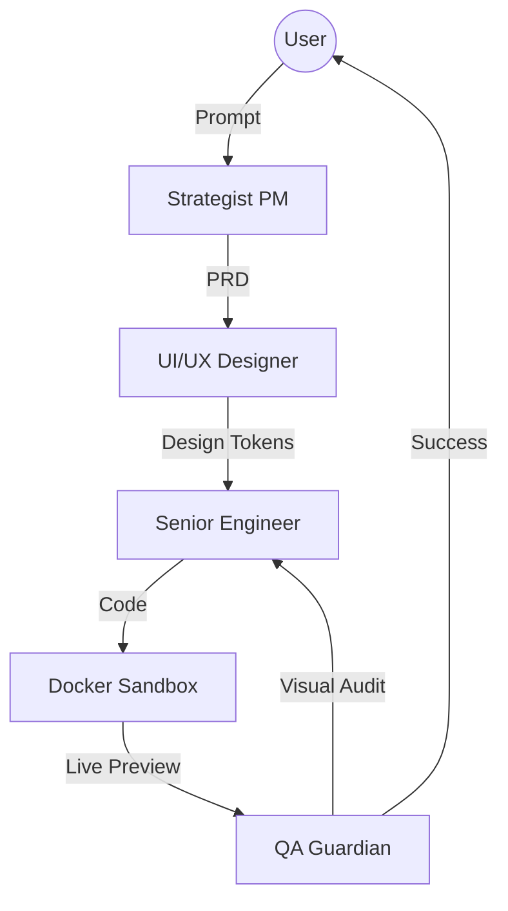

# 🌐 NexusSite-AI

> **面向现代网站的自治 AI 工作室。**  
> 在具备自愈能力的 Docker 沙盒中完成网站的构建、设计与测试，产出可用于生产环境的交付物。

[](https://opensource.org/licenses/MIT)
[](https://www.python.org/)
[](https://www.docker.com/)
[](https://github.com/langchain-ai/langgraph)

---

## 🚀 概览

**NexusSite-AI** 不只是一个代码生成器，而是一支全栈、多智能体（MAS）的 AI 团队，覆盖 Web 开发的完整生命周期——从需求分析到可部署的交付质量。

不同于传统 AI 工具只输出零散的代码片段，NexusSite-AI 在 **双容器沙盒（Dual-Container Sandbox）** 内运行，确保每一行代码在交付之前都完成构建、渲染，并通过视觉验收。

### 为什么选择 NexusSite-AI？

- **自治工作流**：基于 LangGraph 的多智能体系统（MAS），模拟真实研发团队的协作方式。
- **自愈闭环**：若构建失败或 UI 破坏，QA Guardian 会触发自动修复回路。
- **视觉一致性**：集成多模态视觉能力，保证最终 UI 与设计意图一致。
- **Docker 优先**：零配置运行环境，减少“在我电脑上能跑”的环境差异问题。

---

## 🏗️ 架构

NexusSite-AI 采用 **控制与执行分离（Control-Execution Separation）** 的架构模型：

1. **Orchestrator（大脑）**：FastAPI + LangGraph，负责管理 4 个智能体的状态机。
2. **Sandbox（工厂）**：独立的 Node.js/Next.js 环境，用于实时渲染与预览。



---

## 👥 智能体团队

| Agent | Expertise | Deliverables |
| :--- | :--- | :--- |
| **🕵️ Strategist PM** | Market Research & SEO | Structured PRD & Sitemap |
| **🎨 UI/UX Designer** | Modern Aesthetics & Tailwind | Design Tokens & Layout Specs |
| **💻 Senior Engineer** | Next.js & Atomic Design | Production-grade React Code |
| **🔍 QA Guardian** | Build Integrity & VQA | Bug Reports & Visual Validation |

---

## ⚡ 快速开始

### 前置条件
- Docker & Docker Compose
- OpenAI API Key（推荐使用 GPT-4o）

### 安装与启动
1. **克隆仓库：**
   ```bash
   git clone https://github.com/yourname/NexusSite-AI.git
   cd NexusSite-AI
   ```

2. **配置环境变量：**
   ```bash
   cp .env.example .env
   # Add your OPENAI_API_KEY to .env
   ```

3. **启动工作室：**
   ```bash
   docker-compose up
   ```

4. **开始构建：**
   打开 `http://localhost:8000`，与 AI 团队对话并开始生成网站。

---

## 🗺️ 路线图

- [ ] **阶段 1（MVP）**：支持单页 Next.js + Tailwind。（当前）
- [ ] **阶段 2**：多页面动态路由与 CMS 集成。
- [ ] **阶段 3**：一键部署到 Vercel/Netlify。
- [ ] **阶段 4**：定制化 Figma-to-Code 资产流水线。

---

## 🎬 Demo GIF 脚本

按以下分镜脚本录制 15–20 秒的屏幕演示视频：

| Time | Left Panel (Chat / Agent Status) | Right Panel (Live Preview) |
| :--- | :--- | :--- |
| **0-3s** | User types: *"Create a dark-themed landing page for a futuristic AI startup."* Click send. | Blank canvas |
| **3-7s** | "Strategist PM is researching..." → "UI/UX Designer is generating palette..." | Background color loads |
| **7-12s** | "Senior Engineer writing HeroSection.tsx..." | Components appear like LEGO blocks |
| **12-15s** | "QA Guardian found a build error, fixing..." | Error appears → auto-fix → success |
| **15-20s** | "Project ready. Download source code [Link]" | Responsive scroll showcase |

---

## 🤝 贡献指南

欢迎社区贡献！无论是优化智能体提示词（prompts），还是增加新的 Docker 工具，都可以先阅读 `CONTRIBUTING.md` 了解协作方式。

---

## ⭐ 支持项目

如果你觉得这个项目有帮助，欢迎点个 Star 支持我。这将帮助项目获得更多关注与贡献者。